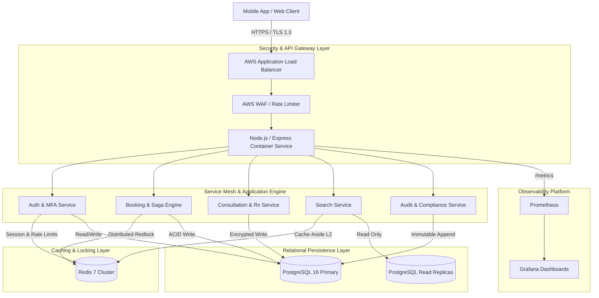
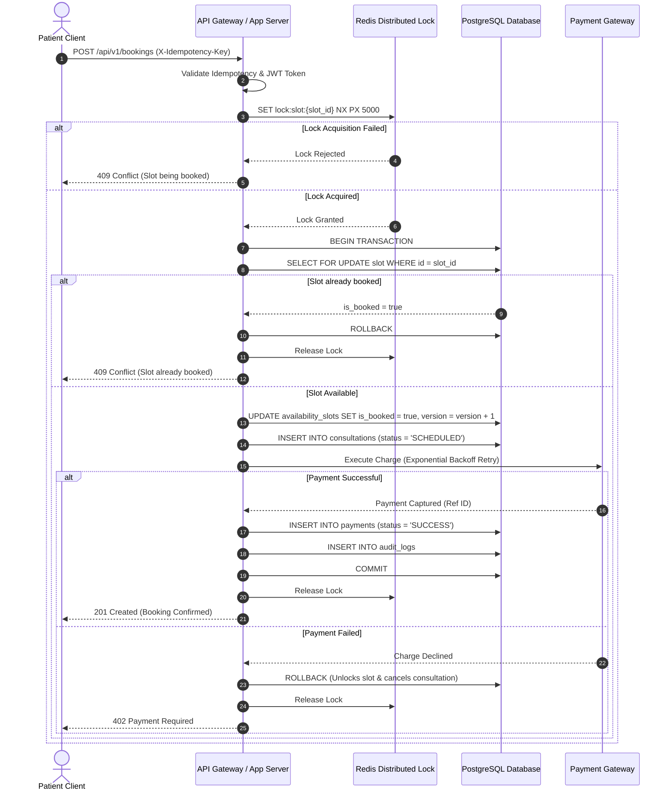
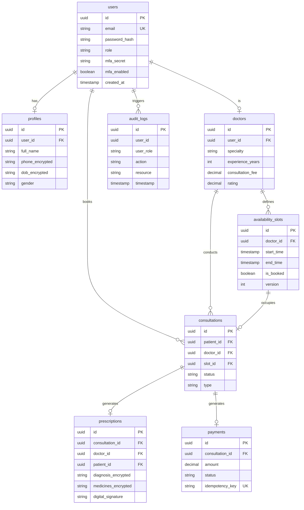

# Architecture & System Design Document
## Amrutam Telemedicine Platform Backend

---

## 1. Executive Summary & Capacity Planning (100k Scale)

Amrutam’s Telemedicine Platform is engineered for enterprise high availability (99.95%), strict PHI security (HIPAA & DISHA compliance), and low-latency response times under peak workloads (**p95 <200ms for reads, <500ms for writes**).

### Workload & Scalability Breakdown
- **Daily Consultation Volume**: 100,000 completed consultations / day.
- **Average Throughput (RPS)**:
  $$\text{RPS}_{\text{avg}} = \frac{100,000}{86,400 \text{ seconds}} \approx 1.16 \text{ consultations/sec}$$
- **Peak Load Factor**: $10\times$ peak factor during peak doctor consultation hours (09:00 - 12:00, 17:00 - 20:00).
  $$\text{RPS}_{\text{peak}} = 1.16 \times 10 \approx 11.6 \text{ write operations/sec}$$
- **Read-to-Write Ratio**: Estimated $20:1$ read-to-write ratio (Doctor searches, schedule viewings, prescription views, user profiles).
  $$\text{RPS}_{\text{read, peak}} = 11.6 \times 20 \approx 232 \text{ read requests/sec}$$
- **Database Connection Sizing**:
  - PostgreSQL instance with connection pooling (`pg-pool`) max 20 connections per instance.
  - Multi-AZ RDS Primary for writes + 2 Read Replicas for search/read query offloading.
  - Redis Cluster for L2 Cache (sub-millisecond latency) & Redlock concurrency locking.

---

## 2. High-Level Architecture & Data Flow

---

## 3. Booking Flow Sequence Diagram (Saga & Concurrency Control)

---

## 4. Entity-Relationship (ER) Diagram

---

## 5. API Schema & HTTP Idempotency

### Idempotency Mechanics (`X-Idempotency-Key`)
To ensure safety against double-charging or duplicate bookings during network retries:
1. Client generates a unique UUIDv4 key and sends `X-Idempotency-Key: <UUID>` header.
2. Middleware inspects Redis / PostgreSQL `idempotency_keys` table.
3. If matching key found with completed response -> returns cached HTTP status & body with header `X-Cache-Lookup: HIT`.
4. If key is currently executing -> returns `409 Conflict`.
5. If key is new -> executes request, caches response for 24 hours.

---

## 6. Retry & Backoff Strategies

External calls (payment gateways, notification hooks, SMS services) use **Exponential Backoff with Full Jitter**:

$$\text{Sleep} = \min(\text{MaxDelay}, \text{InitialDelay} \times 2^{\text{attempt}}) \times \text{random}(0.5, 1.5)$$

- `maxRetries`: 3
- `initialDelayMs`: 100ms
- `maxDelayMs`: 3000ms

---

## 7. Data Partitioning & Storage Strategy

- **Audit Logs Partitioning**: Declarative time-based table partitioning on `audit_logs` by month (`audit_logs_2026_09`, `audit_logs_2026_10`). Allows fast drop/archival of expired compliance records after 7 years.
- **Consultations Partitioning**: Range partitioning by `created_at` date ranges.
- **Index Optimization**: B-Tree indexes on `(doctor_id, start_time)` filtered by `WHERE is_booked = FALSE`.

---

## 8. Caching & Concurrency Strategy

- **Cache-Aside Pattern (L2 Redis)**:
  - Doctor search results cached for 60 seconds (`search:doctors:*`).
  - Doctor availability cached and invalidated immediately upon new slot creation or booking (`doctor:{id}:slots`).
- **Distributed Locking (Redlock)**: Redis single/multi instance locking with atomic Lua release script preventing double-booking during high concurrency.
- **Optimistic Locking**: PostgreSQL `version` column increments on slot state updates (`UPDATE availability_slots SET version = version + 1 WHERE version = current_version`).

---

## 9. Transaction Management & Sagas

- **Orchestrated Saga Pattern**:
  - **Local ACIDs**: Slot reservation + Consultation record + Payment log committed in a single PostgreSQL transaction block.
  - **Compensating Actions**: If external payment fails, DB transaction rolls back slot reservation and consultation record, returning slot back to `is_booked = FALSE`.

---

## 10. Disaster Recovery (DR) & Backup Strategy

- **RPO (Recovery Point Objective)**: $< 5$ minutes (Automated PostgreSQL WAL streaming archiving to AWS S3 bucket).
- **RTO (Recovery Time Objective)**: $< 15$ minutes (AWS Aurora Multi-AZ automatic failover < 30 seconds, terraform scripted infrastructure recreation).
- **Point-in-Time Recovery (PITR)**: Enabled up to 35 days.
